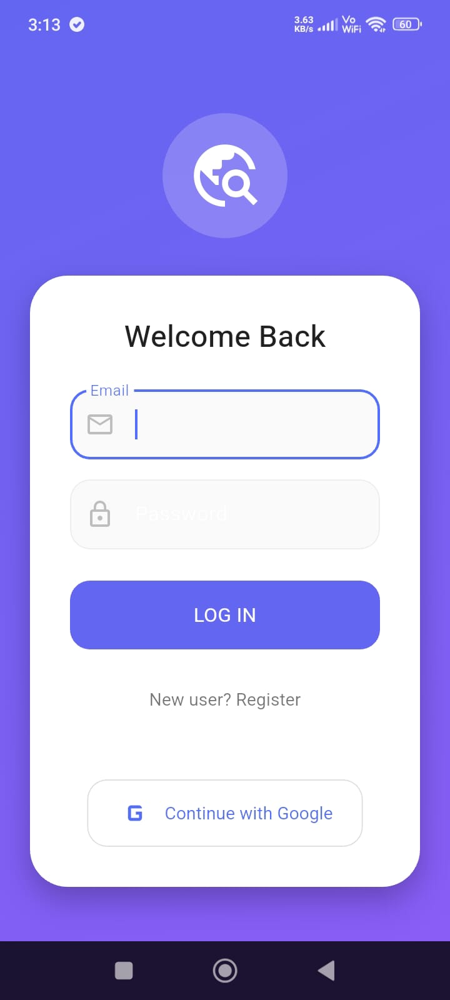
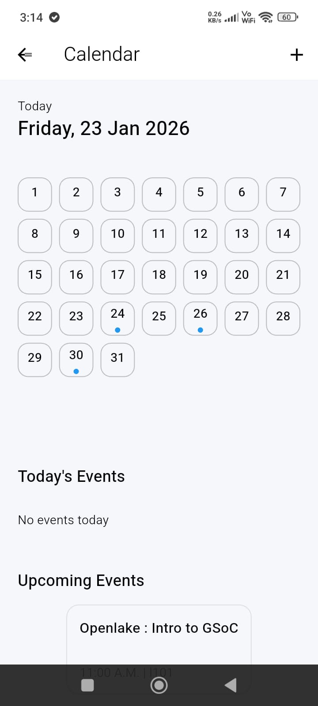
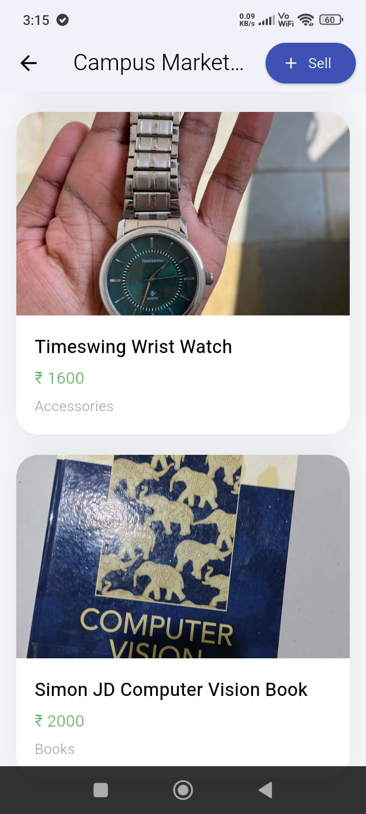
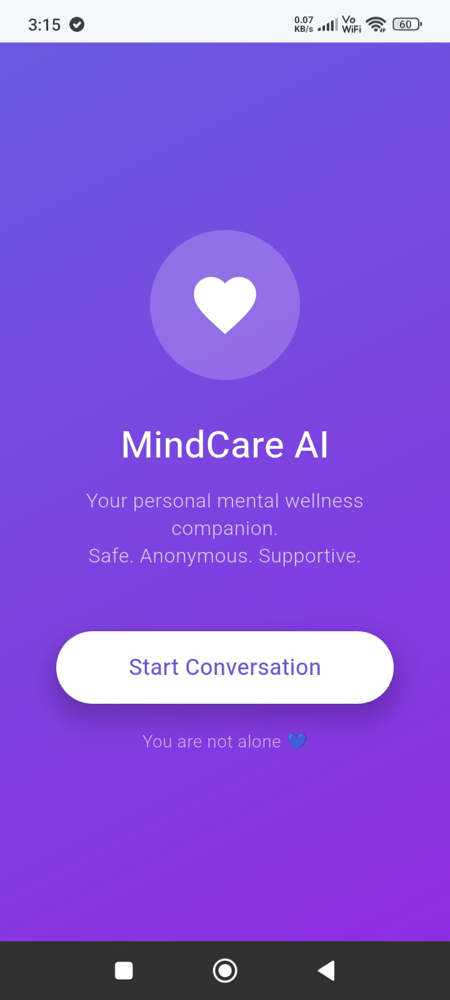

# CampusHub AI

CampusHub AI is a modular, AI-powered campus application built using Flutter (by Google) and Firebase.  
It solves multiple real institute-level problems through independent yet integrated modules, all inside a single mobile app.

---

## Modules Included

1. **Lost & Found (AI-powered)**
   - Post lost/found items
   - AI similarity matching using Google Gemini API
   - Match confidence and reasoning
   - One-click email contact

2. **Campus Calendar**
   - Month-wise calendar view
   - Today’s and upcoming events
   - Event details (venue, organizer, description)

3. **Campus Marketplace**
   - Buy and sell items inside campus
   - Product cards with image, price, and category
   - Contact seller via email

4. **Campus Pulse (Polls)**
   - Quick Yes/No or MCQ polls
   - One vote per user
   - Animated result display

5. **MindCare AI**
   - AI-based mental wellness chatbot
   - Grounded responses using predefined prompts
   - Mood buttons + free-text chat

---

## Google Technologies Used

- Flutter (by Google) – Cross-platform app development
- Firebase Authentication – Secure login
- Cloud Firestore – Real-time database
- Firebase Cloud Storage – Image storage
- Google Gemini API – AI reasoning & similarity matching
- Material Design 3 – Modern UI system
- Android Studio – Development environment

---

## Project Folder Structure

lib/
├── auth.dart
├── main.dart
├── main_home.dart
├── home.dart
├── item_list.dart
├── match_view.dart
├── matches_tab.dart
├── details_page.dart
├── gemini_service.dart
├── cloudinary_service.dart
├── create_post.dart
│
├── calendar/
│   ├── calendar_home.dart
│   ├── month_view.dart
│   ├── day_view.dart
│   ├── event_detail.dart
│   ├── admin_calendar.dart
│   └── event_service.dart
│
├── marketplace/
│   ├── marketplace_home.dart
│   ├── add_product.dart
│   ├── product_card.dart
│   └── product_detail.dart
│
├── pulse/
│   ├── pulse_home.dart
│   └── pulse_admin.dart
│
├── wellness/
│   ├── wellness_home.dart
│   ├── wellness_chat.dart
│   ├── wellness_admin.dart
│   └── wellness_service.dart

---

## Firestore Collections Used

items            - Lost & Found posts
matches          - AI-generated matches
Events           - Campus events
marketplace      - Buy/Sell products
pulse_polls      - Campus polls
wellness_chats   - Mental wellness chats

---

## Setup Instructions

### Prerequisites
- Flutter SDK
- Android Studio
- Firebase project
- Google Gemini API key

---

### Clone Repository
```bash
git clone https://github.com/your-username/campushub-ai.git
cd campushub-ai


⸻

Install Dependencies

flutter pub get


⸻

Firebase Setup
	1.	Create a Firebase project
	2.	Enable Authentication (Email + Google)
	3.	Enable Cloud Firestore and Cloud Storage
	4.	Add Android app in Firebase Console
	5.	Download google-services.json
	6.	Place it in:

android/app/google-services.json


⸻

Configure Gemini API

Open:

lib/gemini_service.dart

Add:

const String GEMINI_API_KEY = "YOUR_API_KEY";

Do the same for wellness_service.dart
⸻

Run App

flutter run


⸻

Demo-https://drive.google.com/file/d/1zYiajdlKiq_Ye4mH0VL4HWCb0wP56M56/view?usp=drive_link

A 3-minute demo video is provided showing:
	•	Authentication
	•	Dashboard with modules
	•	Lost & Found AI matching
	•	Calendar events
	•	Marketplace
	•	Polls
	•	MindCare AI chatbot

⸻

## 📱 App Preview (Android)

<p align="center">
  
  
  
  
  
  
  

</p>